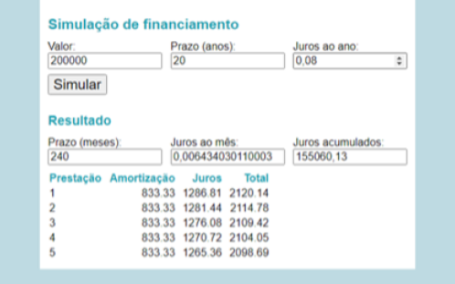

## :coffee: Trabalho prático
---
Sistema para simulação de empréstimo utilizando SAC
---
---

### :heavy_check_mark: Objetivos

Exercitar os seguintes conceitos trabalhados no Módulo:

✓ Documentos HTML.

✓ Estilização com CSS.

✓ Programação em JavaScript.

✓ Reagir a eventos e alterar o DOM.

---

### Enunciado

Construa, utilizando HTML, CSS e JavaScript, uma página para simulação de um financiamento com base nos dados fornecidos, exibindo o valor das primeiras prestações, de acordo com o Sistema de Amortizações Constantes (SAC).

---

> :rocket: **Atividades**

1. Crie uma página com três campos de entrada numéricos: Valor, Prazo (anos) e Juros
ao ano. Tais campos devem estar inicialmente preenchidos com os valores 200.000, 20 e 0,08, respectivamente.

2. Adicione um botão Simular. Ao apertar o botão, calcule e exiba na interface as seguintes informações:
    
    a. Prazo (meses): prazo total do financiamento em meses, ou seja, o valor de Prazo (anos) multiplicado por 12.
    
    b. Juros ao mês: taxa de juros mensal corresponde à taxa anual informada. Tal taxa pode ser calculada com a seguinte fórmula:

    > <em>
    > jm = (1 + ja) (1/12) - 1
    > </em>

    Onde jm é a taxa mensal, e ja é a taxa anual.
    
    c. Juros acumulados: soma de todos os valores pagos de juros, considerando todas as prestações, até o final do financiamento (mais detalhes no item 3).
    
    d. Tabela com o valor das 5 primeiras prestações, indicando o valor pago como amortização, o valor pago como juros e o total (soma dos dois).

3. O cálculo da parcela deve ser feito de acordo com o Sistema de Amortizações Constantes (SAC). Neste sistema, a  parcela é composta de:
    
    a. Amortização: valor total financiado dividido pelo número de prestações. Este valor é o mesmo em todas as prestações. Por exemplo, se foi financiado 200.000,00 em 240 parcelas, a amortização é 833,33.
    
    b. Juros: saldo devedor multiplicado pelos juros ao mês. O saldo devedor inicialmente é o valor total, e diminui a cada prestação paga de acordo com o valor de amortização. Por exemplo, ao calcular a terceira prestação, o saldo devedor seria: 200.000,00 – 2 × 833,33.

4. Para simplificar, assuma que os campos de entrada sempre estarão preenchidos corretamente. Ou seja, não é obrigatório tratar o caso do valor, prazo ou juros ao ano estarem vazios ou com valores inválidos.

5. Estilize a aplicação usando CSS da maneira que achar adequado. A única exigência é utilizar cor de texto diferente para destacar um ou mais elementos. A imagem é um exemplo de possível interface, apenas como inspiração:

 

 
